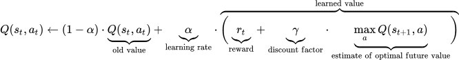
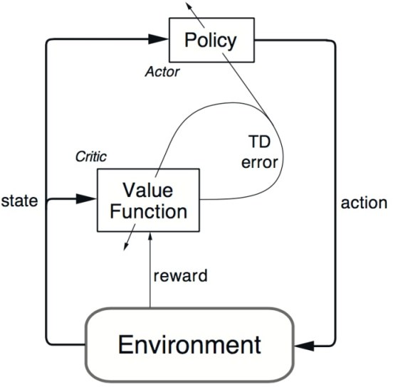

5 Things You Need to Know about Reinforcement Learning
================
Robert A. Stevens
2021-11-04

<https://www.kdnuggets.com/2018/03/5-things-reinforcement-learning.html>

Tags: Machine Learning, Markov Chains, Reinforcement Learning, Richard
Sutton

*With the popularity of Reinforcement Learning continuing to grow, we
take a look at five things you need to know about RL.*

By Shweta Bhatt, Youplus

Reinforcement Learning is one of the hottest research topics currently
and its popularity is only growing day by day. Let’s look at 5 useful
things to know about RL.

## 1. What is reinforcement learning? How does it relate with other ML techniques?

Reinforcement Learning (RL) is a type of machine learning technique that
enables an agent to learn in an interactive environment by trial and
error using feedback from its own actions and experiences.

Though both supervised and reinforcement learning use mapping between
input and output, unlike supervised learning where feedback provided to
the agent is correct set of actions for performing a task, reinforcement
learning uses rewards and punishment as signals for positive and
negative behavior.

As compared to unsupervised learning, reinforcement learning is
different in terms of goals. While the goal in unsupervised learning is
to find similarities and differences between data points, in
reinforcement learning the goal is to find a suitable action model that
would maximize the total cumulative reward of the agent. The figure
below represents the basic idea and elements involved in a reinforcement
learning model.

**Figure 1:** *Reinforcement Learning*

## 2. How to formulate a basic reinforcement Learning problem?

Some key terms that describe the elements of a RL problem are:

-   **Environment:** Physical world in which the agent operates

-   **State:** Current situation of the agent

-   **Reward:** Feedback from the environment

-   **Policy:** Method to map agent’s state to actions

-   **Value:** Future reward that an agent would receive by taking an
    action in a particular state

A Reinforcement Learning problem can be best explained through games.
Let’s take the game of PacMan where the goal of the agent (PacMan) is to
eat the food in the grid while avoiding the ghosts on its way. The grid
world is the interactive environment for the agent. PacMan receives a
reward for eating food and punishment if it gets killed by the ghost
(loses the game). The states are the location of PacMan in the grid
world and the total cumulative reward is PacMan winning the game.

In order to build an optimal policy, the agent faces the dilemma of
exploring new states while maximizing its reward at the same time. This
is called **Exploration vs Exploitation trade-off**.

Markov Decision Processes (MDPs) are mathematical frameworks to describe
an environment in reinforcement learning and almost all RL problems can
be formalized using MDPs:

<https://en.wikipedia.org/wiki/Markov_decision_process>

An MDP consists of a set of finite environment states S, a set of
possible actions A(s) in each state, a real valued reward function R(s)
and a transition model P(s’, s \| a). However, real world environments
are more likely to lack any prior knowledge of environment dynamics.
Model-free RL methods come handy in such cases.

Q-learning is a commonly used model free approach which can be used for
building a self-playing PacMan agent:

<https://en.wikipedia.org/wiki/Q-learning>

It revolves around the notion of updating Q values which denotes value
of doing action a in state s. The value update rule is the core of the
Q-learning algorithm.

**Figure 2:** *Reinforcement Learning Update Rule*

**Figure 3:** *PacMan*

Here’s a video of a Deep reinforcement learning PacMan agent:

<https://www.youtube.com/watch?v=QilHGSYbjDQ>

## 3. What are some most used Reinforcement Learning algorithms?

Q-learning and State-Action-Reward-State-Action (SARSA) are two commonly
used model-free RL algorithms. They differ in terms of their exploration
strategies while their exploitation strategies are similar. While
Q-learning is an off-policy method in which the agent learns the value
based on action a\* derived from the another policy, SARSA is an
on-policy method where it learns the value based on its current action
derived from its current policy. These two methods are simple to
implement but lack generality as they do not have the ability to
estimate values for unseen states.

This can be overcome by more advanced algorithms such as Deep Q-Networks
(DQNs), which use Neural Networks to estimate Q-values:

<https://deepmind.com/research/dqn/>

But DQNs can only handle discrete, low-dimensional action spaces. Deep
Deterministic Policy Gradient (DDPG) is a model-free, off-policy,
actor-critic algorithm that tackles this problem by learning policies in
high dimensional, continuous action spaces:

“Continuous Control with Deep Reinforcement Learning”
<https://arxiv.org/abs/1509.02971>

**Figure 4:** *actor-critic architecture for Reinforcement Learning*

## 4. What are the practical applications of Reinforcement Learning?

Since, RL requires a lot of data, therefore it is most applicable in
domains where simulated data is readily available like gameplay,
robotics.

-   RL is quite widely used in building AI for playing computer games
    -   AlphaGo Zero is the first computer program to defeat a world
        champion in the ancient Chinese game of Go
    -   Others include ATARI games, Backgammon, etc.

<https://deepmind.com/blog/alphago-zero-learning-scratch/>

-   In robotics and industrial automation, RL is used to enable the
    robot to create an efficient adaptive control system for itself
    which learns from its own experience and behavior
    -   DeepMind’s work on Deep Reinforcement Learning for Robotic
        Manipulation with Asynchronous Policy updates is a good example
        of the same:

<https://deepmind.com/research/publications/deep-reinforcement-learning-robotic-manipulation/>

-   Watch this interesting demonstration video:

<https://www.youtube.com/watch?v=ZhsEKTo7V04&t=48s>

-   Other applications of RL include text summarization engines, dialog
    agents (text, speech) which can learn from user interactions and
    improve with time, learning optimal treatment policies in healthcare
    and RL based agents for online stock trading

## 5. How can I get started with Reinforcement Learning?

For understanding the basic concepts of RL,

-   *Reinforcement Learning: An Introduction*, a book by the father of
    Reinforcement Learning, Richard Sutton, and his doctoral advisor,
    Andrew Barto
    -   An online draft of the book is available here:

<http://incompleteideas.net/book/the-book-2nd.html>

<https://en.wikipedia.org/wiki/Richard_S._Sutton>

<https://en.wikipedia.org/wiki/Andrew_Barto>

-   Teaching material from David Silver including video lectures is a
    great introductory course on RL

<http://www0.cs.ucl.ac.uk/staff/d.silver/web/Teaching.html>

-   Here’s another technical tutorial on RL by Pieter Abbeel and John
    Schulman (Open AI/Berkeley AI Research Lab)

<http://people.eecs.berkeley.edu/~pabbeel/nips-tutorial-policy-optimization-Schulman-Abbeel.pdf>

-   For getting started with building and testing RL agents,

-   This blog on how to train a Neural Network ATARI Pong agent with
    Policy Gradients from raw pixels by Andrej Karpathy will help you
    get your first Deep Reinforcement Learning agent up and running in
    just 130 lines of Python code:

<http://karpathy.github.io/2016/05/31/rl/>

-   DeepMind Lab is an open source 3D game-like platform created for
    agent-based AI research with rich simulated environments:

<https://deepmind.com/blog/open-sourcing-deepmind-lab/>

-   Project Malmo is another AI experimentation platform for supporting
    fundamental research in AI:

<https://www.microsoft.com/en-us/research/project/project-malmo/>

-   OpenAI gym is a toolkit for building and comparing reinforcement
    learning algorithms:

<https://gym.openai.com/>

**Bio:** Shweta Bhatt is AI researcher with experience in private and
public sector, passionate about the impact and applications of deriving
knowledge from data to solve challenging problems. She likes telling
stories with data and is based in London.

<https://www.linkedin.com/in/shweta-bhatt-1a930b12/>

## Related:

-   *Resurgence of AI During 1983-2010*

<https://www.kdnuggets.com/2018/02/resurgence-ai-1983-2010.html>

-   *Exclusive: Interview with Rich Sutton, the Father of Reinforcement
    Learning*

<https://www.kdnuggets.com/2017/12/interview-rich-sutton-reinforcement-learning.html>

-   *When reinforcement learning should not be used?*

<https://www.kdnuggets.com/2017/12/when-reinforcement-learning-not-used.html>

-   *Making Machine Learning Simple*

<https://www.kdnuggets.com/2018/03/databricks-ebook-making-machine-learning-simple.html>
