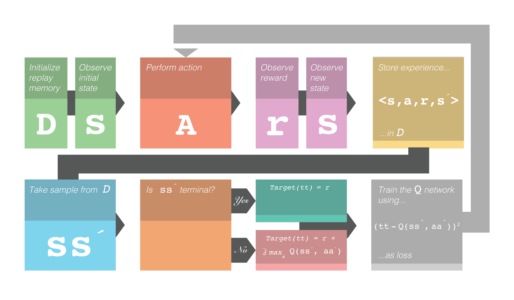
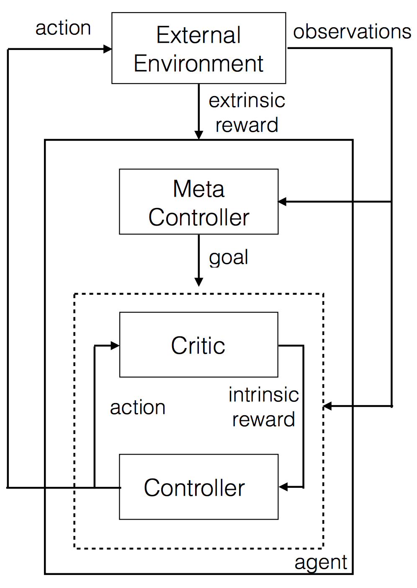
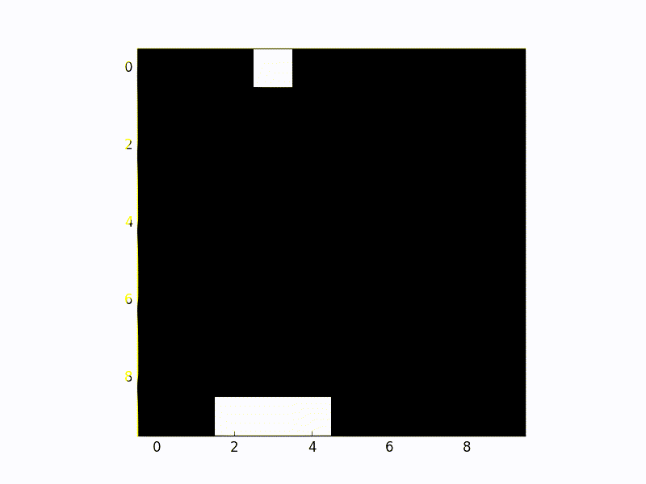

https://buzzrobot.com/5-ways-to-get-started-with-reinforcement-learning-b96d1989c575

by Harshvardhan Gupta, Sep 5, 2017

Machine learning algorithms, and neural networks in particular, are considered to be the cause of a new AI ‘revolution’. In this article I will introduce the concept of reinforcement learning but with limited technical details so that readers with a variety of backgrounds can understand the essence of the technique, its capabilities and limitations.

*At the end of the article, I will provide links to a few resources for implementing RL.*

## What is Reinforcement Learning?

Broadly speaking, data-driven algorithms can be categorized into three types: 

1. Supervised

2. Unsupervised

3. Reinforcement learning

The first two are generally used to perform tasks such as image classification, detection, etc. While their accuracy is remarkable, these tasks differ from those that we would expect from an ‘intelligent’ being.

This is where reinforcement learning comes in. The concept itself is very simple, and much like our evolutionary process: the environment rewards the agent for things that it gets right and penalizes it for things that it gets wrong. The main challenge is developing the capacity to learn several million possible ways of doing things.

## Q Learning & Deep Q Learning

Q learning is a widely used reinforcement learning algorithm. Without going into the detailed math, the given quality of an action is determined by what state the agent is in. The agent usually performs the action which gives it the maximum reward. The detailed math can be found here:

https://en.wikipedia.org/wiki/Q-learning

In this algorithm, the agent learns the quality(Q value) of each action (action is also called policy) based on how much reward the environment gave it. The value of each environment’s state, along with the Q value is usually stored in a table. As the agent interacts with the environment, the Q values get updated from random values to values that actually help maximize reward.

### Deep Q Learning

The problem with using Q learning with tables is that it doesn’t scale well. If the number of states is too high, the table will not fit in memory. This is where Deep Q learning could be applied. Deep learning is basically just a universal approximation machine which can understand and come up with abstract representations. Deep learning can be used to approximate Q values, and it can also easily learn optimal Q values by using gradient descent.

>Fun Fact: Google has a patent on some elements of Deep Q learning: https://www.google.com/patents/US20150100530

## Exploration vs Exploitation

It is often the case that the agent memorizes one path and will never try to explore any other paths. In general, we would like an agent to not only exploit good paths, but also sometimes explore new paths that it can perform actions in. Therefore, a hyper-parameter, named ε, is used to govern how much to explore new paths vs how much to exploit old paths.

## Experience Replay

When training a neural network, data imbalance plays a very important role. If a model is trained as the agent interacts with the environment, there will be imbalances. The most recent play will obviously have more bearing than older plays.

Therefore, all the states, along with related data, is stored in the memory, and the neural network can randomly pick a batch of some interactions and learn (this makes it very similar to supervised learning).

## The Training Framework

This is what the whole framework for deep Q learning looks like. Note the 𝛾. This represents the discounted reward. It is a hyperparameter that controls how much weight the future reward will have. The symbolˊ denotes next. e.g. sˊ denotes next state.

{width=100%}

## Extending Reinforcement Learning

Reinforcement learning works well with many things, such as AlphaGo:

https://deepmind.com/research/case-studies/alphago-the-story-so-far

but it often fails in places where the feedback is sparse. The agent will not explore behaviors that are actually beneficial in the long term. Sometimes, exploring some actions is needed for its own sake (intrinsic motivation) instead of directly trying to solve problems.

Doing this allows the agent to perform complicated actions and essentially allows the agent to ‘plan’ things. Hierarchical Learning [2] allows for such kinds of abstract learning:

{width=100%}

In this kind of a setup, there are two Q networks. They are represented as the controller and meta-controller. The meta controller looks at the raw states and calculates which ‘goal’ to follow. The controller takes in the states along with the goal and outputs a policy to solve the goal. The critic checks if the goal is reached and gives some reward to the controller. The controller stops when the episode ends, or when the goal is reached. The meta controller then chooses a new goal, and this repeats.

The ‘goal’ is something that will eventually help the agent get to the final reward. This is better because it’s possible to have Q learning on top of Q learning in a hierarchical fashion.

## Introductory Resources for Reinforcement Learning

This list will be helpful for those who are looking to get started with Reinforcement Learning:

1. The Basics of Deep Q Learning. Very helpful for understanding the math and processes of Reinforcement Learning.

https://software.intel.com/content/www/us/en/develop/tools/frameworks.html

2. The Hierarchical Learning paper, for those who want to understand Hierarchical Learning in detail.

"Hierarchical Deep Reinforcement Learning: Integrating Temporal Abstraction and Intrinsic Motivation" https://arxiv.org/pdf/1604.06057.pdf

3. Hierarchical Learning paper explanation video from the authors.

https://www.youtube.com/watch?v=tyRUql_ZR7Q

4. Deep RL: An Overview What I would consider the Reinforcement Learning handbook. It covers nearly every aspect of RL that is required to understand the current level of research. It delves deep into the math, but also provides high-level overviews.

"Deep Reinforcement Learning: An Overview" https://arxiv.org/abs/1701.07274

5. Implementing Deep Q learning with a single python script. Perhaps the simplest deep Q learning implementation. This is very easy to read and a great starting point.

https://gist.github.com/EderSantana/c7222daa328f0e885093#file-qlearn-py-L157

{width=100%}
