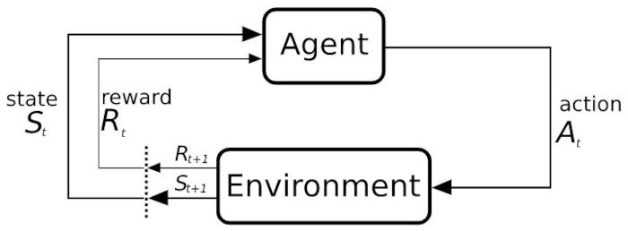

Hands-On Reinforcement Learning Course, Part 1
================
Robert A. Stevens
2022-01-06

<https://www.kdnuggets.com/2021/12/hands-on-reinforcement-learning-course-part-1.html>

Tags: Agents, Beginners, Python, Reinforcement Learning

*Start your learning journey in Reinforcement Learning with this first
of two part tutorial that covers the foundations of the technique with
examples and Python code.*

By Pau Labarta Bajo, mathematician and data scientist

This first part covers the bare minimum concept and theory you need to
embark on this journey from the fundamentals to cutting edge
Reinforcement Learning (RL), step-by-step, with coding examples and
tutorials in Python. In each following chapter, we will solve a
different problem with increasing difficulty.

Ultimately, the most complex RL problems involve a mixture of RL
algorithms, optimization, and Deep Learning (DL). You do not need to
know DL to follow along with this course. I will give you enough context
to get you familiar with DL philosophy and understand how it becomes a
crucial ingredient in modern RL.

In this first lesson, we will cover the fundamentals of RL with
examples, 0 maths, and a bit of Python.

## 1. What is a RL problem?

RL is an area of Machine Learning (ML) concerned with learning problems
where

> An intelligent agent needs to learn, through trial and error, how to
> take actions inside and environment in order to maximize a cumulative
> reward.

RL is the kind of ML closest to how humans and animals learn.

What is an agent? And an environment? What are exactly these actions the
agent can take? And the reward? Why do you say cumulative reward?

If you are asking yourself these questions, you are on the right track.

The definition I just gave introduces a bunch of terms that you might
not be familiar with. In fact, they are ambiguous on purpose. This
generality is what makes RL applicable to a wide range of seemingly
different learning problems. This is the philosophy behind mathematical
modeling, which stays at the roots of RL.

Let’s take a look at a few learning problems, and see how they use the
RL lens.

### Example 1: Learning to walk

As a father of a baby who recently started walking, I cannot stop asking
myself, how did he learn that?

As a ML engineer, I fantasize about understanding and replicating that
incredible learning curve with software and hardware.

Let’s try to model this learning problem using the RL ingredients:

-   The **agent** is my son, Kai
    -   And he wants to stand up and walk
    -   His muscles are strong enough at this point in time to have a
        chance at it
    -   The learning problem for him is: how to sequentially adjust his
        body position, including several angles on his legs, waist,
        back, and arms to balance his body and not fall
-   The **environment** is the physical world surrounding him, including
    the laws of physics
    -   The most important of which is gravity
    -   Without gravity, the learning-to-walk problem would drastically
        change and even become irrelevant: why would you want to walk in
        a world where you can simply fly?
    -   Another important law in this learning problem is Newton’s third
        law, which in plain words tells that if you fall on the floor,
        the floor is going to hit you back with the same strength -
        ouch!
-   The **actions** are all the updates in these body angles that
    determine his body position and speed as he starts chasing things
    around
    -   Sure he can do other things at the same time, like imitating the
        sound of a cow, but these are probably not helping him
        accomplish his goal
    -   We ignore these actions in our framework
    -   Adding unnecessary actions does not change the modeling step,
        but it makes the problem harder to solve later on
    -   An important (and obvious) remark is that Kai does not need to
        learn the physics of Newton to stand up and walk
    -   He will learn through observing the state of the environment,
        taking action, and collecting feedback from this environment
    -   He does not need to learn a model of the environment to achieve
        his goal
-   The **reward** he receives is a stimulus coming from the brain that
    makes him happy or makes him feel pain
    -   There is the negative reward he experiences when falling on the
        floor, which is physical pain, maybe followed by frustration
    -   On the other side, there are several things that contribute
        positively to his happiness, like the happiness of getting to
        places faster or the external stimulus that comes from my wife
        Jagoda and me when we say “good job!” or “bravo!” to each
        attempt and marginal improvement he shows

### A little bit more about rewards

The reward is a signal to Kai that what he has been doing is good or bad
for his learning. As he takes new actions and experiences pain or
happiness, he starts to adjust his behavior to collect more positive
feedback and less negative feedback. In other words, he learns

Some actions might seem very appealing for the baby at the beginning,
like trying to run to get a boost of excitement. However, he soon learns
that in some (or most) cases, he ends up falling on his face and
experiencing an extended period of pain and tears. This is why
intelligent agents maximize cumulative reward and not marginal reward.
They trade short-term rewards with long-term ones. An action that would
give immediate reward, but put my body in a position about to fall, is
not an optimal one.

Great happiness followed by greater pain is not a recipe for long-term
well-being. This is something that babies often learn easier than we
grown-ups.

The frequency and intensity of the rewards are key for helping the agent
learn. Very infrequent (sparse) feedback means harder learning. Think
about it, if you do not know if what you do is good or bad, how can you
learn? This is one of the main reasons why some RL problems are harder
than others.

Reward shaping is a tough modeling decision for many real-world RL
problems.

### Example 2: Learning to play Monopoly like a PRO

As a kid, I spent a lot of time playing Monopoly with friends and
relatives. Well, who hasn’t? It is an exciting game that combines luck
(you roll the dices) and strategy.

Monopoly is a real-estate board game for two to eight players. You roll
two dices to move around the board, buying and trading properties, and
developing them with houses and hotels. You collect rent from your
opponents, with the goal being to drive them into bankruptcy.

If you were so into this game that you wanted to find intelligent ways
to play it, you could use some RL.

What would the 4 RL ingredients be?

-   The **agent** is you, the one who wants to win at Monopoly.

-   Your **actions** are the ones you see on this screenshot below:

**Action space in Monopoly. Credits to aleph aseffa.**

-   The **environment** is the current state of the game, including the
    list of properties, positions, and cash amount each player has
    -   There is also the strategy of your opponent, which is something
        you cannot predict and lies outside of your control
-   And the **reward** is 0, except in your last move, where it is +1 if
    you win the game and -1 if you go bankrupt
    -   This reward formulation makes sense but makes the problem hard
        to solve
    -   As we said above, a more sparse reward means a harder solution
    -   Because of this, there are other ways to model the reward,
        making them noisier but less sparse

<http://doc.gold.ac.uk/aisb50/AISB50-S02/AISB50-S2-Bailis-paper.pdf>

When you play against another person in Monopoly, you do not know how
she or he will play. What you can do is play against yourself. As you
learn to play better, your opponent does too (because it is you),
forcing you to level up your game to keep on winning. You see the
positive feedback loop.

This trick is called self-play. It gives us a path to bootstrap
intelligence without using the external advice of an expert player.
Self-play is the main difference between AlphaGo and AlphaGo Zero, the
two models developed by DeepMind that play the game of Go better than
any human.

<https://deepmind.com/research/case-studies/alphago-the-story-so-far>

<https://deepmind.com/blog/article/alphago-zero-starting-scratch>

### Example 3: Learning to drive

In a matter of decades (maybe less), machines will drive our cars,
trucks, and buses.

But, how?

Learning to drive a car is not easy. The goal of the driver is clear: to
get from point A to point B comfortably for her and any passengers on
board.

There are many external aspects to the driver that make driving
challenging, including:

-   other drivers behavior

-   traffic signs

-   pedestrian behaviors

-   pavement conditions

-   weather conditions

-   …even fuel optimization (who wants to spend extra on this?)

How would we approach this problem with RL?

-   The **agent** is the driver who wants to get from A to B comfortably

-   The **state** of the environment the driver observes has lots of
    things, including the position, speed, and acceleration of the car,
    all other cars, passengers, road conditions, or traffic signs

    -   Transforming such a big vector of inputs into an appropriate
        action is challenging, as you can imagine

-   The **actions** are basically three: the direction of the steering
    wheel, throttle intensity, and break intensity

-   The **reward** after each action is a weighted sum of the different
    aspects you need to balance when driving

    -   A decrease in distance to point B brings a positive reward,
        while an increase in a negative one
    -   To ensure no collisions, getting too close (or even colliding)
        with another car or even a pedestrian should have a very big
        negative reward
    -   Also, in order to encourage smooth driving, sharp changes in
        speed or direction contribute to a negative reward

After these 3 examples, I hope the following representation of RL
elements and how they play together makes sense:

**RL in a nutshell. Credits to Wikipedia.**

<https://commons.wikimedia.org/wiki/File:Markov_diagram_v2.svg>

Now that we understand how to formulate an RL problem, we need to solve
it.

But how?

## 2. Policies and value functions

### Policies

The agent picks the action she thinks is the best based on the current
state of the environment. This is the agent’s strategy, commonly
referred to as the agent’s policy.

> A policy is a learned mapping from states to actions.

> Solving a RL problem means finding the best possible policy.

Policies are deterministic when they map each state *s* to one action
*a*:

*π*(*s*) = *a*

or stochastic when they map each state to a probability distribution
over all possible actions:

*π*(*s*) = (*p*(*a*1),*p*(*a*2),...,*p*(*a**N*))

*Stochastic* is a word you often read and hear in ML, and it essentially
means *uncertain* or *random*. In environments with high uncertainty,
like Monopoly where you are rolling dices, stochastic policies are
better than deterministic ones.

There exist several methods to actually compute this optimal policy.
These are called policy optimization methods.

### Value functions

Sometimes, depending on the problem, instead of directly trying to find
the optimal policy, one can try to find the value function associated
with that optimal policy.

> But, what is a value function? And before that, what does value mean
> in this context?

> The value is a number associated with each state s of the environment
> that estimates how good it is for the agent to be in state s.

> It is the cumulative reward the agent collects when starting at state
> s and choosing actions according to policy π.

> A value function is a learned mapping from states to values.

The value function of a policy is commonly denoted as

*v**π*(*s*) = cumulative reward when the agent starts at
state *s* and follows policy *π*

Value functions can also map pairs of (action, state) to values. In this
case, they are called q-value functions.

*q**π*(*s*,*a*) = cumulative reward when the agen starts at
state *s* takes action *a* and follows policy *π* thereafter

The optimal value function (or q-value function) satisfies a
mathematical equation, called the Bellman equation:

*q*\*(*s*,*a*) = *E*\[*R**t* + 1+*γ*max*a*′*q*\*(*s*′,*a*′)\]

This equation is useful because it can be transformed into an iterative
procedure to find the optimal value function.

*But, why are value functions useful?*

Because you can infer an optimal policy from an optimal q-value
function.

*How?*

The optimal policy is the one where at each state s the agent chooses
the action a that maximizes the q-value function.

So, you can jump from optimal policies to optimal q-functions and vice
versa.

There are several RL algorithms that focus on finding optimal q-value
functions. These are called Q-Learning methods.

### The zoology of RL algorithms

There are lots of different RL algorithms. Some try to directly find
optimal policies, and others q-value functions, and others both at the
same time.

The zoology of RL algorithms is diverse and a bit intimidating.

There is no one-size-fits-all when it comes to RL algorithms. You need
to experiment with a few of them each time you solve an RL problem and
see what works for your case.

As you follow along this course, you will implement several of these
algorithms and gain an insight into what works best in each situation.

## 3. How to generate training data?

RL agents are VERY data-hungry.

To solve RL problems, you need a lot of data.

A way to overcome this hurdle is by using simulated environments.
Writing the engine that simulates the environment usually requires more
work than solving the RL problem. Also, changes between different engine
implementations can render comparisons between algorithms meaningless.

This is why guys at OpenAI released the Gym toolkit back in 2016.

<https://gym.openai.com/>

OpenAIs’s gym offers a standardized API for a collection of environments
for different problems, including

-   classic Atari games

-   robotic arms

-   landing on the Moon (well, a simplified one)

There are proprietary environments, too, like MuJoCo (recently bought by
DeepMind).

<https://www.endtoend.ai/envs/gym/mujoco/>

<https://venturebeat.com/2021/10/18/deepmind-acquires-and-open-sources-robotics-simulator-mujoco/>

MuJoCo is an environment where you can solve continuous control tasks in
3D, like learning to walk.

OpenAI Gym also defines a standard API to build environments, allowing
third parties (like you) to create and make your environments available
to others.

If you are interested in self-driving cars, then you should check out
CARLA, the most popular open urban driving simulator.

## 4. Python boilerplate code

You might be thinking:

*What we covered so far is interesting, but how do I actually write all
this in Python?*

And I completely agree with you

Let’s see how all this looks like in Python.

    import random

    def train(n_episodes: int):
        """
        Pseudo-code of a RL agent training loop
        """

        # python object that wraps all environment logic. 
        # Typically you will be using OpenAI gym here.
        env = load_env()

        # python object that wraps all agent policy (or value function)
        # parameters, and action generation methods.
        agent = get_rl_agent()

        for episode in range(0, n_episodes):

            # random start of the environmnet
            state = env.reset()

            # epsilon is parameter that controls the exploitation-exploration trade-off.
            # it is good practice to set a decaying value for epsilon
            epsilon = get_epsilon(episode)

            done = False
            while not done:

                if random.uniform(0, 1) < epsilon:
                    # Explore action space
                    action = env.action_space.sample()
                else:
                    # Exploit learned values (or policy)
                    action = agent.get_best_action(state)

                # environment transitions to next state and maybe rewards the agent.
                next_state, reward, done, info = env.step(action)

                # adjust agent parameters. We will see how later in the course.
                agent.update_parameters(state, action, reward, next_state)

                state = next_state

Did you find something unclear in this code?

What about line 23? What is this epsilon?

Don’t panic. I didn’t mention this before, but I won’t leave you without
an explanation.

Epsilon is a key parameter to ensure our agent explores the environment
enough before drawing definite conclusions on what is the best action to
take in each state.

It is a value between 0 and 1, and it represents the probability the
agent chooses a random action instead of what she thinks is the best
one.

This tradeoff between exploring new strategies vs. sticking to already
known ones is called the exploration-exploitation problem. This is a key
ingredient in RL problems and something that distinguishes RL problems
from supervised ML.

Technically speaking, we want the agent to find the global optimum, not
a local one.

It is good practice to start your training with a large value (e.g.,
50%) and progressively decrease after each episode. This way, the agent
explores a lot at the beginning and less as it perfects its strategy.

## 5. Recap and homework

The key takeaways for this 1st part are:

-   Every RL problem has an agent (or agents), environment, actions,
    states, and rewards

-   The agent sequentially takes actions with the goal of maximizing
    total rewards

    -   For that, it needs to find the optimal policy

-   Value functions are useful as they give us an alternative path to
    find the optimal policy

-   In practice, you need to try different RL algorithms for your
    problem and see what works best

-   RL agents need a lot of training data to learn. OpenAI gym is a
    great tool to re-use and create your environments

-   Exploration vs. exploitation is necessary when training RL agents to
    ensure the agent does not get stuck in local optimums

A course without a bit of homework would not be a course.

I want you to pick a real-world problem that interests you and that you
could model and solve using RL.

Define what are the agent(s), actions, states, and rewards.

Feel free to send me an e-mail at <plabartabajo@gmail.com> with your
problem, and I can give you feedback.

Original. Reposted with permission.

<http://datamachines.xyz/2021/11/17/hands-on-reinforcement-learning-course-part-1/>

## More On This Topic

Hands-on Reinforcement Learning Course Part 3: SARSA

<https://www.kdnuggets.com/2022/01/handson-reinforcement-learning-course-part-3-sarsa.html>

Facebook Launches One of the Toughest Reinforcement Learning…

<https://www.kdnuggets.com/2021/06/facebook-launches-toughest-reinforcement-learning-challenges.html>

Top Stories, Sep 30 - Oct 6: The Last SQL Guide for Data Analysis…

<https://www.kdnuggets.com/2019/10/top-news-week-0930-1006.html>

Hands-On Reinforcement Learning Course, Part 2

<https://www.kdnuggets.com/2021/12/hands-on-reinforcement-learning-part-2.html>

Getting Started with Reinforcement Learning

<https://www.kdnuggets.com/2021/04/getting-started-reinforcement-learning.html>

KDnuggets™ News 19:n37, Oct 2: The Future of Analytics & Data…

<https://www.kdnuggets.com/2019/n37.html>
