https://towardsdatascience.com/reinforcement-learning-explained-visually-part-4-q-learning-step-by-step-b65efb731d3e

*A Visual Guide to how and why the Q Learning Algorithm works, in Plain English*

Ketan Doshi, Nov 27

This is the fourth article in my series on Reinforcement Learning (RL). We now have a good understanding of the concepts that form the building blocks of an RL problem, and the techniques used to solve them. We can now bring these together to learn about complete solutions used by the most popular RL algorithms.

In this article, it is exciting to now dive into our first RL algorithm and go over the details of Q Learning! You can find many resources explaining step-by-step what the algorithm does, but my aim with this article is to give an intuitive sense of why this algorithm converges and gives us the optimal values.

Here’s a quick summary of the previous and following articles in the series. My goal throughout will be to understand not just how something works but why it works that way.

1. Intro to Basic Concepts and Terminology: What is an RL problem, and how to apply an RL problem-solving framework to it using techniques from Markov Decision Processes and concepts such as Return, Value, and Policy

https://towardsdatascience.com/reinforcement-learning-made-simple-part-1-intro-to-basic-concepts-and-terminology-1d2a87aa060

2. Solution Approaches: Overview of popular RL solutions, and categorizing them based on the relationship between these solutions; important takeaways from the Bellman equation, which is the foundation for all RL algorithms

https://towardsdatascience.com/reinforcement-learning-made-simple-part-2-solution-approaches-7e37cbf2334e

3. Model-free algorithms: Similarities and differences of Value-based and Policy-based solutions using an iterative algorithm to incrementally improve predictions. Exploitation, Exploration, and ε-greedy policies

https://towardsdatascience.com/reinforcement-learning-explained-visually-part-3-model-free-solutions-step-by-step-c4bbb2b72dcf

4. Q-Learning — this article: In-depth analysis of this algorithm, which is the basis for subsequent deep-learning approaches. Develop intuition about why this algorithm converges to the optimal values

5. Deep Q Networks: Our first deep-learning algorithm. A step-by-step walkthrough of exactly how it works, and why those architectural choices were made

8. Policy Gradient: Our first policy-based deep-learning algorithm

7. Actor-Critic: Sophisticated deep-learning algorithm which combines the best of Deep Q Networks and Policy Gradients

9. Surprise Topic: Stay tuned!

If you haven’t read the earlier articles, particularly the second and third ones, it would be a good idea to read them first, as this article builds on many of the concepts that we discussed there.

## Q Learning Overview

Q-Learning is the most interesting of the Lookup-Table-based approaches which we discussed previously because it is what Deep Q Learning is based on.

The Q-learning algorithm uses a Q-table of State-Action Values (also called Q-values). This Q-table has a row for each state and a column for each action. Each cell contains the estimated Q-value for the corresponding state-action pair.

We start by initializing all the Q-values to zero. As the agent interacts with the environment and gets feedback, the algorithm iteratively improves these Q-values until they converge to the Optimal Q-values. It updates them using the Bellman equation.

## How do we construct a Q-table?

Let’s take a simple game as an example. Consider a 3x3 grid, where the player starts in the Start square and wants to reach the Goal square as their final destination, where they get a reward of 5 points. Some squares are Clear while some contain Danger, with rewards of 0 points and -10 points respectively. In any square, the player can take four possible actions to move Left, Right, Up, or Down.

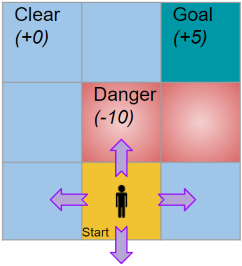{width=100%}

This problem has 9 states since the player can be positioned in any of the 9 squares of the grid. It has 4 actions. So we construct a Q-table with 9 rows and 4 columns.

Now we can use the Q-table to lookup the Q-value for any state-action pair. eg. The value in a particular cell, say ((2, 2), Up) is the Q-value (or State-Action value) for the state (2, 2) and action ‘Up’.

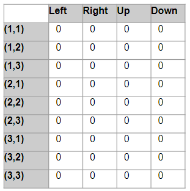{width=100%}

We start by initializing all the Q-values to 0.

## Q Learning Algorithm

As we just saw, Q-learning finds the Optimal policy by learning the optimal Q-values for each state-action pair.

Let’s look at the overall flow of the Q-Learning algorithm. Initially, the agent randomly picks actions. But as the agent interacts with the environment, it learns which actions are better, based on rewards that it obtains. It uses this experience to incrementally update the Q values.

This flow is very similar to the flow that we covered in the last article. So we will not repeat the explanation for all the steps again.

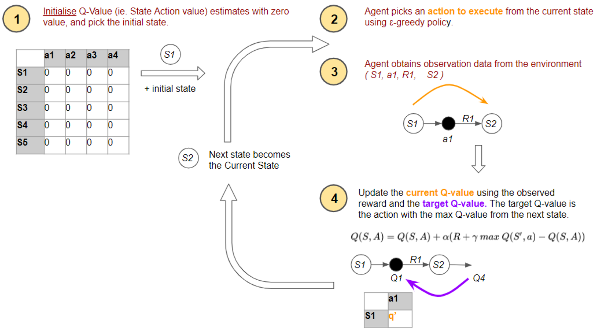{width=100%}

The difference, which is the key hallmark of the Q Learning algorithm, is how it updates its estimates. The equation used to make the update in the fourth step is based on the Bellman equation, but if you examine it carefully it uses a slight variation of the formula we had studied earlier.

Let’s zoom in on the flow and examine this in more detail.

## Q Learning uses two different actions in each time-step

Let’s look at an example to understand this.

In step #2 of the algorithm, the agent uses the ε-greedy policy to pick the current action (a1) from the current state (S1). This is the action that it passes to the environment to execute, and gets feedback in the form of a reward (R1) and the next state (S2).

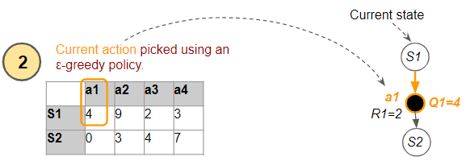{width=100%}

Now, for step #4, the algorithm has to use a Q-value from the next state in order to update its estimated Q-value (Q1) for the current state and selected action.

And here is where the Q-Learning algorithm uses its clever trick. The next state has several actions, so which Q-value does it use? It uses the action (a4) from the next state which has the highest Q-value (Q4). What is critical to note is that it treats this action as a target action to be used only for the update to Q1. It is not necessarily the action that it will actually end up executing from the next state when it reaches the next time step.

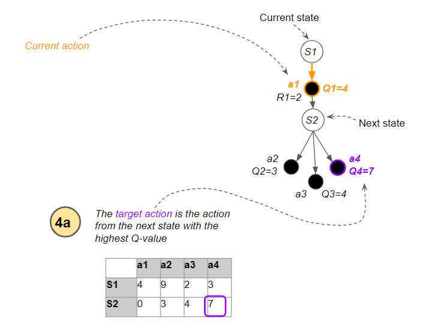{width=100%}

Now that it has identified the target Q-value, it uses the update formula to compute a new value for the current Q-value, using the reward and the target Q-value...

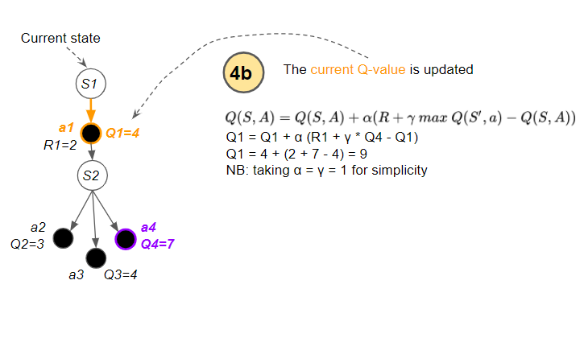{width=100%}

... and updates the current Q-value.

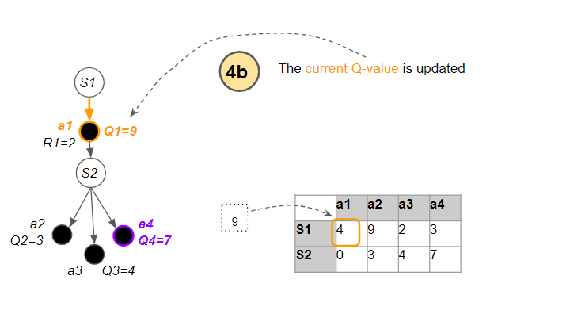{width=100%}

In other words, there are two actions involved:

1. Current action — the action from the current state that is actually executed in the environment, and whose Q-value is updated

2. Target action — has the highest Q-value from the next state, and used to update the current action’s Q value

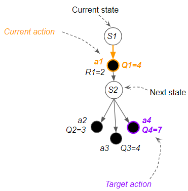{width=100%}

This duality of actions is what makes Q-Learning unique:

- We can explore and discover new paths for actions that we execute

- However, when we update Q-value estimates to improve them, we always use the best Q-value, even though that action may not get executed

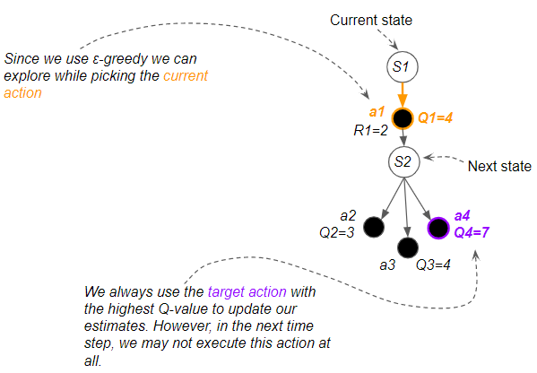{width=100%}

This might sound confusing, so let’s move forward to the next time-step to see what happens. Now the next state has become the new current state.

The agent again uses the ε-greedy policy to pick an action. If it ends up exploring rather than exploiting, the action that it executes (a2) will be different from the target action (a4) used for the Q-value update in the previous time-step.

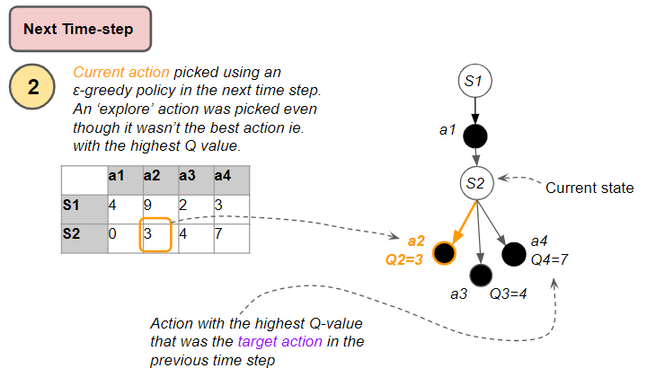{width=100%}

This is known as ‘off-policy’ learning because the actions that are executed are different from the target actions that are used for learning.

## How does the Q-table get populated?

At the start of the game, the agent doesn’t know which action is better than any other action. So we start by giving all Q-values arbitrary estimates and set all entries in the Q-table to 0.

Let’s see an example of what happens in the first time-step so we can visualize how the Q-table gets populated with actual values.

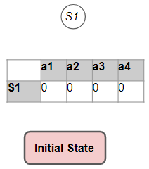{width=100%}

The algorithm then picks an ε-greedy action, gets feedback from the environment, and uses the formula to update the Q-value, as below. This new Q-value reflects the reward that we observed.

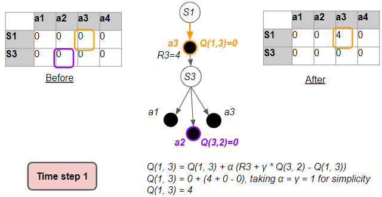{width=100%}

In this way, one cell of the Q-table has gone from zero values to being populated with some real data from the environment.

Our goal is for the Q-values to converge towards their Optimal Values. We are seeing those Q-values getting populated with something, but, are they being updated with random values, or are they progressively becoming more accurate?

## Why do estimates become more accurate over time? (part 1)

If you think about it, it seems utterly incredible that an algorithm such as Q Learning converges to the Optimal Value at all.

You start with arbitrary estimates, and then at each time-step, you update those estimates with other estimates.

So why does this eventually give you better estimates?

The reason is that at every time-step, the estimates become slightly more accurate because they get updated with real observations.

The update formula combines three terms in some weighted proportion:

- The reward for the current action

- Best Estimated Q-value of the next state-action

- Estimated Q-value of the current state-action

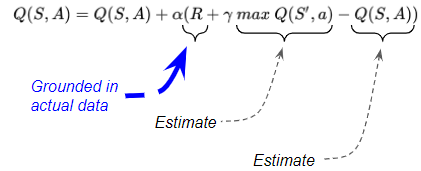{width=100%}

Two of the three terms in the update formula are estimates which are not very accurate at first. We’ll address those two terms a little later.

However, the third term ie. the reward received is concrete data. That allows the agent to learn and improve its estimates based on actual experience with the environment.

## The Q-value gets updated with real rewards

To visualize this more clearly, let’s take an example where we focus on just one cell in the Q-table (ie. one state-action pair), and follow the progression of the updates to that one cell.

Let’s see what happens over time to the Q-value for state S3 and action a1 (corresponding to the orange cell). The very first time we visit it, this cell has a Q-value of 0. In fact, most of the Q-table is filled with zeros. Using the update formula, we update this cell with a value that is largely based on the reward (R1) that we observed.

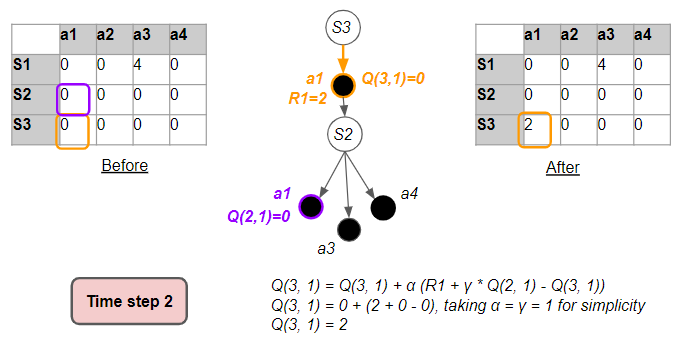{width=100%}

Now let’s see what happens when we visit that state-action pair again. This could be within the same episode, or in a future episode.

This time we see that some of the other Q-values in the table have also been filled with values. As the agent follows various paths and starts to visit state-action pairs, those cells which were previously zeros have been populated.

Also, notice that the reward each time (for the same action from the same state) need not be the same.

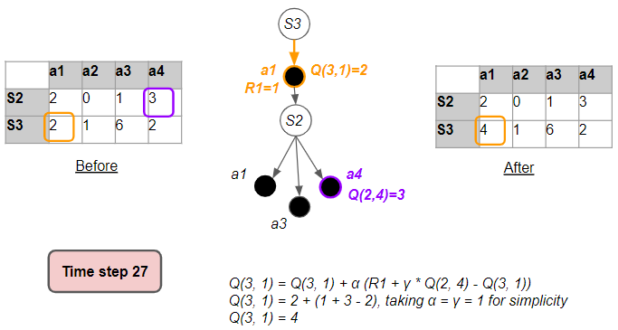{width=100%}

Let’s visit that cell a third time. By the way, notice that the target action (in purple) need not be the same in each of our three visits.

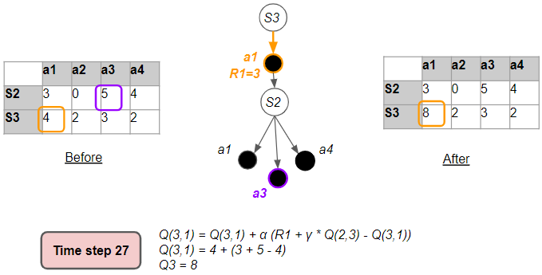{width=100%}

Let’s layout all our visits to that same cell in a single picture to visualize the progression over time. As we visit that same state-action pair more and more times over many episodes, we collect rewards each time. An individual reward observation might fluctuate, but over time, the rewards will converge towards their expected values. This allows the Q-value to also converge over time.

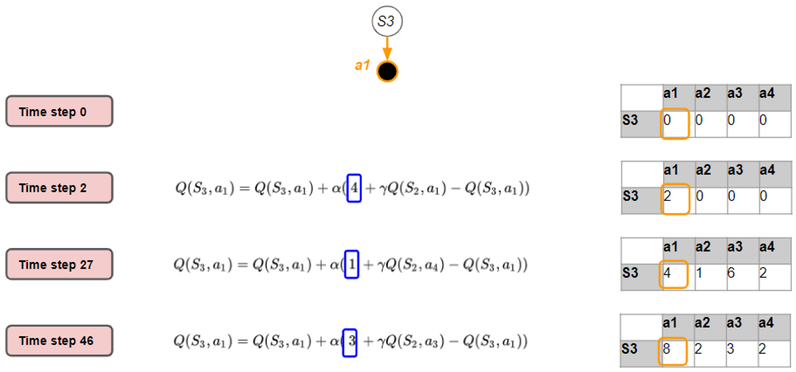{width=100%}

Recall what the Q-value (or State-Action value) represents. It says that you start by taking a particular action from a particular state, then follow the policy after that till the end of the episode, and then measure the Return. And if you did this many, many times, over many episodes, the Q-value is the average Return that you would get.

## Why do estimates become more accurate over time? (part 2)

We’ve seen how the Reward term converges towards the mean or expected value over many iterations.

But what about the other two terms in the update formula which were Estimates and not actual data? Although they start out being very inaccurate, they also do get updated with real observations over time, improving their accuracy.

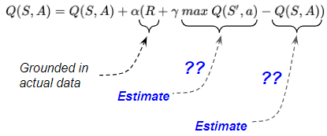{width=100%}

To get a sense of this, let’s look at an example from the final two time-steps of an episode as we reach the Terminal state. What we will see is that the Terminal Q-value accuracy improves because it gets updated with solely real reward data and no estimated values. And that Q-value starts to trickle back to the Q-value before it, and so on, progressively improving the accuracy of Q-values back up the path.

We’ll follow updates of the Terminal Q-value (blue cell) and the Before-Terminal Q-value (green cell) at the end of the episode.

Let’s say that towards the end of Episode 1, in the (T — 1)ˢᵗ time-step, the agent picks an action as below. The Before-Terminal Q-value is updated based on the target action.

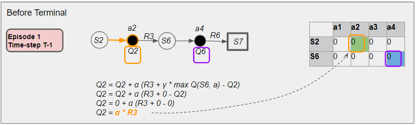{width=100%}

*NB: For simplicity, we will use the notation Q2 and Q6 instead of Q(2, 2) and Q(6,4) respectively*

The next time-step is the last one of Episode 1. Here in the Tᵗʰ time-step, the agent picks an action to reach the next state which is a Terminal state.

Since the next state is Terminal, there is no target action. So the ‘max’ term in the update formula is 0. This means that the update to the Terminal Q-value is based solely on the actual reward data, and it does not rely on any estimated values. That causes the accuracy of the Terminal Q-value to improve. This ends the episode.

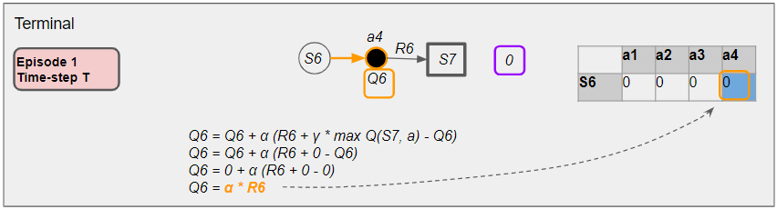{width=100%}

Whenever we visit the Before-Terminal state again in a subsequent episode, say Episode 2, in the (T — 1)ˢᵗ time-step, the Before-Terminal Q-value is updated based on the target action as before.

The ‘max’ term in the update formula corresponds to the Terminal Q-value. So, when the update happens, it is as though this Terminal Q-value gets transmitted backward to the Before-Terminal Q-value.

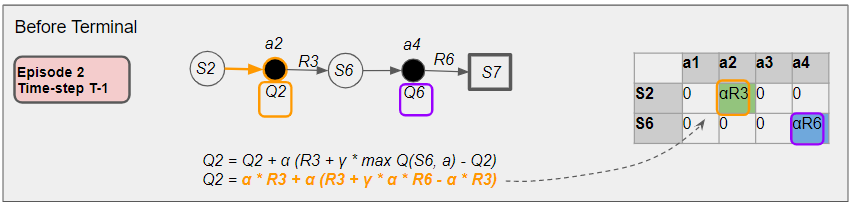{width=100%}

Let’s lay out these three time-steps in a single picture to visualize the progression over time. We have seen that the Terminal Q-value (blue cell) got updated with actual data and not an estimate. We have also seen that this Terminal Q-value trickles back to the Before-Terminal Q-value (green cell).

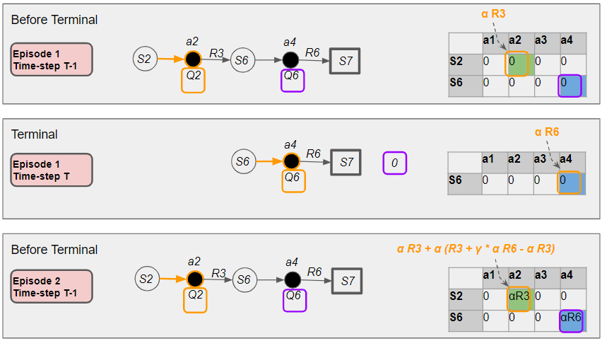{width=100%}

Hence as the accuracy of the Terminal Q-value slowly improves, the Before-Terminal Q-value also becomes more accurate.

Subsequently, those Q-Values trickle back to the (T — 2)ᵗʰ time-step and so on.

In this way, as the estimated Q-values trickle back up the path of the episode, the two estimated Q-value terms are also grounded in real observations with improving accuracy.

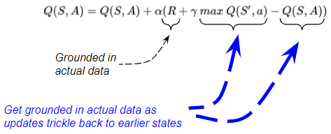{width=100%}

## Q-table estimates become more accurate as more episodes are run

As we do more and more iterations, more accurate Q-values slowly get transmitted to cells further up the path. And as each cell receives more updates, that cell’s Q value becomes more and more accurate.

As more and more episodes are run, values in the Q-table get updated multiple times.

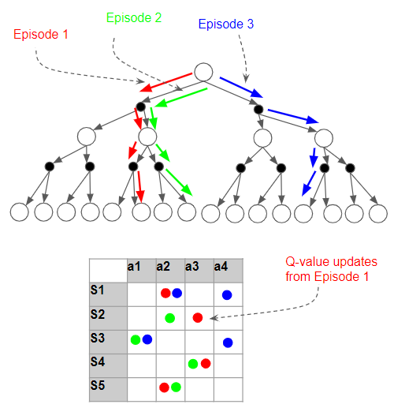{width=100%}

## Q-values converge to Optimal Values

We have just seen that the Q-values are becoming more accurate. But what we really need are the Optimal Values. How do we know that we are getting there?

In the first article, we learned that the State-Action Value always depends on a policy:

https://towardsdatascience.com/reinforcement-learning-made-simple-part-1-intro-to-basic-concepts-and-terminology-1d2a87aa060

The Q-Learning algorithm implicitly uses the ε-greedy policy to compute its Q-values.

This policy encourages the agent to explore as many states and actions as possible. The more iterations it performs and the more paths it explores, the more confident we become that it has tried all the options available to find better Q-values.

These are the two reasons why the ε-greedy policy algorithm eventually does find the Optimal Q-values. We have seen these informally, but we can take comfort from the fact that more formal mathematical proofs do exist.

- With each iteration, the Q-values get better

- If you do enough iterations, you will have evaluated all the possible options, and there will be no better Q-values that you can find

The Q-values incrementally become more accurate with each update, moving closer and closer to the optimal values.

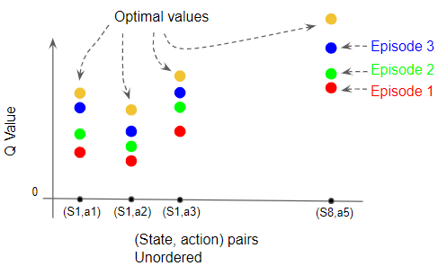{width=100%}

This is not rigorous proof obviously, but hopefully, this gives you a gut feel for how Q Learning works and why it converges.

In the next article, we will start to get to the really interesting parts of Reinforcement Learning and begin our journey with Deep Q Networks. Let’s keep learning!
