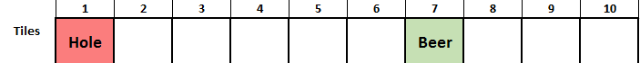
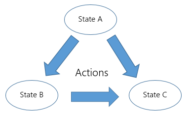
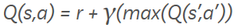

Reinforcement Learning with Q tables
================
Robert A. Stevens
2020-12-20

<https://itnext.io/reinforcement-learning-with-q-tables-5f11168862c8>

by Mohit Mayank, Mar 1, 2018


*Reinforcement learning — Agent’s action and environment’s reply*

## What is reinforcement learning

Reinforcement learning is an area of machine learning dealing with
delayed reward.

**What does this means?**

Well, simple, let me explain this with an example. For this I am
assuming you have heard (better if you know) about neural networks or
even a basic knowledge of regression or classification will do. So lets
take an example of classification problem, you have been given a large
chunk of images of dogs, and you have to design a system which will be
able distinguish between an image by saying if it is of dogs or not.
Anyone with a little knowledge of machine learning will advice you to
use convolution neural network and train with the provided images, and
yeah it will work. But how? Well, without going into details (maybe an
article on this later?) you train the neural network on sample images
first. While training the neural network learns the little features and
pattern unique to a dog image. During training you know the expected
output, it is a dog images, so whenever the network predicts wrong we
correct it. In a way, we know the reward for the provided images, if the
prediction is right, we give positive rewards, if prediction is wrong,
the reward is negative and corrective measures are taken to learn and
adapt. So we know the immediate rewards.

**But what if we don’t know the immediate rewards?**

Here, reinforcement learning comes into the picture.

To explain this, lets create a game. The game is simple, there are 10
tiles in a row. All tiles are not equal, some have hole where we do not
want to go, whereas some have beer, where we definitely want to go. When
the game start, you can spawn on any of tiles, and can either go left or
right. The game will go on unless either we have won or its game over,
lets call each such iteration an episode.



*Go for beer\!*

So, if you spawn on the 0th tile or somehow travels to 0th tile, its
game over but if we travel to tile 6, we win.

Let’s take one simple episode as example. Ok lets say we spawn on tile
2. Now suppose I haven’t shown you the game map and you only have the
option of going left or right, which way will you go? Well you can’t say
unless you try it out. Let’s say you keep on going left, till you are in
tile 0, the tile with hole and you lose. This is not what we want to
happen, so lets assign a negative reward to our action of going left
from 2 to 1 to 0. In next episode by some chance you spawn in tile 2
again, this time you keep on going right, until you reach tile 6. Here
we got the beer, lets assign the actions with positive reward.

**What we learned?**

For every step we take, until we hit the hole or beer, we don’t know of
the rewards. Delayed rewards guys. There is no one who tells you the
right direction, after every step there is no reward, suggesting its the
right or wrong direction. Now its even difficult for us to grasp the
sense of right actions, what if we want the computer to learn this?
Reinforcement learning to the rescue.

## Markov Decision Process

**Now what is this Markov process and why do we need to learn it?**

Well I thought the same and to be clear, we don’t need to deep dive into
it, just a basic intuition would do.

So, Markov decision process is used for modeling decision making in
situations where the outcomes are partly random and partly under the
control of a decision maker. In a nutshell, all the tiles, left & right
actions, the negative & positive reward we discussed can be modeled by
Markov process.

A Markov decision process consist of,

1.  **State (S):** It is a set of states
    
      - Tiles in our example
      - So we have 10 states in our game

2.  **Action (A):** It is a set of actions available form state `s`
    
      - Left & right from our game

3.  **Probability of transition** `P(s'|s, a)`**:** It is the
    probability of transition to `s'` state at time `t+1` if we took
    action `a` in state `s` at time `t`
    
      - We were kinda sorted on this front, a left from tile 3 leads to
        tile 2, no question asked

4.  **Reward** `R(s'|s, a)`**:** It is the reward we receive if we
    transition from state `s` to state `s'` by taking action `a`

5.  **Discount (Y):** It is the discount factor, which represents the
    difference in future and present rewards



*Change of state due to some action. As simple as that\!*

So markov process can be understood as a collection of states `S` with
some actions `A` possible from every state with some probability `P`.
Each such action will lead to some reward `R`. If the probability and
rewards are unknown, the problem is of reinforcement learning. Here we
are going to solve a simple such problem using Q Learning or better the
most basic implementation of it, the Q table.

## Q learning

Now taking all the above learned theory in consideration, we want to
build an agent to traverse our game of beer and holes (looking for
better name) like a human would. For this, we should have a policy which
tells us what to do and when. Think of it as a revealed map of the game.
Better the policy, better our chances of winning the game, hence the
name Q (quality) learning. The quality of our policy will improve upon
training and will keep on improving. To learn, we are going to use the
bellman equation, which goes as follows,



*The bellman equation for discounted future rewards*

where,

  - `Q(s, a)` is the current policy of action `a` from state `s`

  - `r` is the reward for the action

  - `max(Q(s', a'))` defines the maximum future reward
    
      - Say we took action `a` at state `s` to reach state `s'`
      - From here we may have multiple actions, each corresponding to
        some rewards
      - The maximum of that reward is computed

  - `Y` is the discount factor
    
      - The value varies from 0 to 1
      - If value is near 0, immediate reward is given preference
      - If value goes near 1, importance of future rewards increases
        until at 1, and it is considered equal to immediate rewards

Here, we are trying to formulate the delayed rewards into immediate
rewards. For every action we take from a state, we update our policy
table, lets call it Q table, to include a positive or negative reward.
Say, we are in tile 4, and we are going to take a right, making tile 5
the next state, the immediate reward of tile 4 will include some factor
(determined by discount) of the maximum reward of all the action
possible from tile 5. And if you consult the game map, a right from tile
5 leads to tile 6 which is the ultimate goal in our game, so a right
action from tile 4 is also assigned some positive reward.

## Code

Ok too much theory for now, let code.

Let me define the states, actions and rewards as matrix. One way of
doing it is having rows for all the state and columns for actions, so as
we have 10 state and 2 actions, we will define a 10x2 matrix. For
simplicity I am not using any library, just coding them with lists in
python.

``` python
# environment matrix
env = [[None, 0],
       [-100, 0],
       [0, 0],
       [0, 0],
       [0, 0],
       [0, 100],
       [0, 0],
       [100, 0],
       [0, 0],
       [0, None]]

print(env)
```

    [[None, 0], [-100, 0], [0, 0], [0, 0], [0, 0], [0, 100], [0, 0], [100, 0], [0, 0], [0, None]]

As you can see, taking right from tile 5 and taking left from tile 7
have high reward of 100 as it leads to tile 6. Also a left from tile 1
leads to hole, so it has a negative reward. Tile 0 and 9 have left and
right reward as `None` as there are no -1 or 10th tile.

Now its time for our magic Q table, which will update as the agent
learns on each episode.

``` python
q_mat = [[0, 0],
         [0, 0],
         [0, 0],
         [0, 0],
         [0, 0],
         [0, 0],
         [0, 0],
         [0, 0],
         [0, 0],
         [0, 0]]

print(q_mat)
```

    [[0, 0], [0, 0], [0, 0], [0, 0], [0, 0], [0, 0], [0, 0], [0, 0], [0, 0], [0, 0]]

For starters lets assign all to zero.

Defining some function which helps in game traversal.

``` python
win_loss_states = [0, 6]

def getAllPossibleNextAction(cur_pos):

    step_matrix = [x != None for x in env[cur_pos]]
    action = []

    if(step_matrix[0]):
        action.append(0)    

    if(step_matrix[1]):
        action.append(1)

    return(action)

def isGoalStateReached(cur_pos):
    return (cur_pos in [6])

def getNextState(cur_pos, action):

    if (action == 0):
        return cur_pos - 1
    else:
        return cur_pos + 1

def isGameOver(cur_pos):
    return cur_pos in win_loss_states
```

Let’s go though them one by one,

  - `getAllPossibleNextAction` pass your current state and it will
    return all the possible actions. Note for tile 0, only right action
    is there and same goes for tile 9 with only left action

  - `isGoalStateReached` if the current tile is 6 it will return `True`

  - `getNextState` pass current state and the action, and it will return
    the next state

  - `isGameOver` if the state is 0 or 6, the game is over, this returns
    `True`

Now comes the training part:

``` python
import random

g = 0.9 # g = gamma (discount)
lr = 0.1 # learning rate

for _ in range(1000):
    # get starting position
    s = random.choice([0, 1, 2, 3, 4, 5, 6, 7, 8, 9])
    
    # while goal state is not reached
    while(not isGameOver(s)):
        # get all possible next states from cur_step
        possible_actions = getAllPossibleNextAction(s)
        # select any one action randomly
        a = random.choice(possible_actions)
        # find the next state corresponding to the action selected
        s1 = getNextState(s, a)
        # update the q matrix
        q_mat[s][a] = q_mat[s][a] + lr*(env[s][a] + g*max(q_mat[s1]) - q_mat[s][a])
        # go to next state
        s = s1
    
    # print status
    # print("Episode ", _ , " done")

print("Training done...")
```

    Training done...

Let me clarify,

  - First we defined the discount factor and learning rate

  - We are going to train for 1000 episodes

  - Spawning is completely random, it could be any of the tiles

  - While the episode is not over, we keep on taking random actions and
    updating the Q table

After 1000 episodes, Q table some what looks like this,

``` python
print(q_mat)
```

    [[0, 0], [-99.99999999996022, 65.60999998213232], [59.04899996301782, 72.8999999991515], [65.60999999804581, 80.99999999980302], [72.89999999947005, 89.99999999989068], [80.99999999786544, 99.99999999995089], [0, 0], [99.99999999999181, 80.99999999389732], [89.99999999997713, 72.89999999971845], [80.99999999993824, 0]]

Let’s beautify this a little bit:

``` python
import pandas as pd

df = pd.DataFrame(q_mat)
df.index.names = ['Action']
df.columns =['Left', 'Right'] 
print(df)
```

``` 
           Left   Right
Action                 
0         0.000    0.00
1      -100.000   65.61
2        59.049   72.90
3        65.610   81.00
4        72.900   90.00
5        81.000  100.00
6         0.000    0.00
7       100.000   81.00
8        90.000   72.90
9        81.000    0.00
```

Now what our policy says is, if you find yourself at any of the state,
choose the action with higher value and you will reach the tile with
beer. Not bad, right?

## Next Step

What if we increased the complexity of our game by having 2D boards with
multiple holes, well that would be an interesting thing to do.

Note: This note is from my personal website:

<http://mohitmayank.com/>
